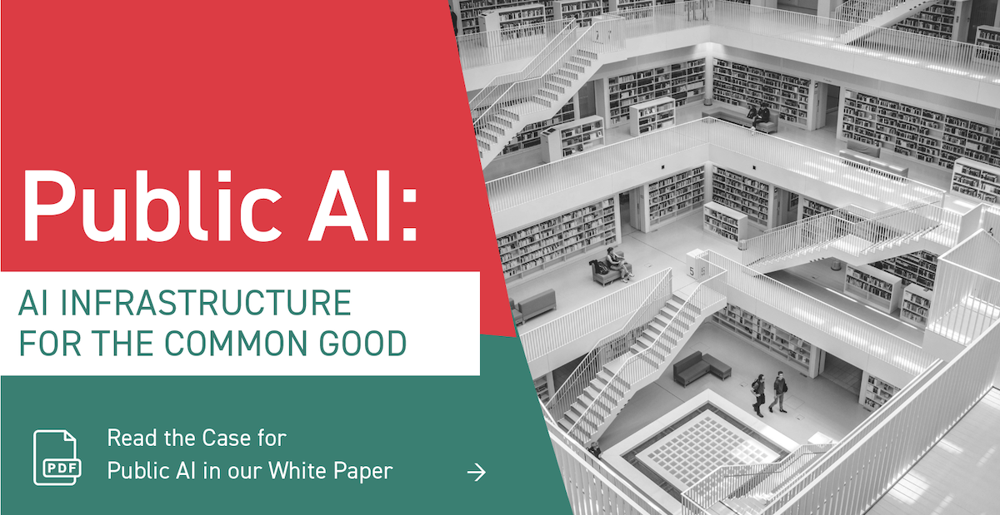

{:target="_blank" rel="noopener"}

## What is public AI?

Public AI is **AI as public infrastructure**: AI provisioned like electricity, parks, highways, libraries, or the Internet itself.

- Public AI is **publicly accessible**: ensuring AI delivers benefits to all.
- Public AI is **publicly accountable**: ensuring AI reflects society's values.
- Public AI creates **permanent public goods**: ensuring AI is a reliable foundation.
- Public AI is being designed and built **right now** - all around the world.

[Learn more about our definition](https://publicai.network/whitepaper){:target="_blank" rel="noopener" class="button"}

## Why do we need public AI?

- Limited public capacity in AI is stifling our collective capacity to shape the direction of society.
- AI is becoming essential infrastructure, like roads and water pipelines - fitting for the public sector.
- AI systems are growing in power and should reflect society's values, not the values of shareholders.
- Private companies have a head start - without investment in public capacity now, the gap will grow.

[Learn more about the policy case here](https://publicai.network/whitepaper){:target="_blank" rel="noopener" class="button"}

## Who we are

The **Public AI Network** is a coalition working to bring about public AI. We aim to:

- Ensure public capacity-building is part of the conversation about AI design, policy, and funding
- Make it easier to build public AI by coordinating research efforts in the ML community
- Support policymakers and technical teams seeking to implement public AI
- Organize the movement for public AI

We host a Slack community which connects together experts from leading public AI projects, thinktanks, and civil society groups. We also host a regular [seminar series](https://publicai.network/seminar) that shares insights from leaders in the field such as [Yoshua Bengio](https://archive.org/details/public-ai-bengio), [Diane Coyle](https://archive.org/details/public-ai-coyle), and [Lawrence Lessig](https://archive.org/details/public-ai-lessig).

## Learn more

- [White Paper](https://bit.ly/publicAIpaper){:target="_blank" rel="noopener"}, currently the best overview
- [Wiki Doc](https://docs.google.com/document/d/1ykjsXpTRZu4Obu9miJlkR9vIqWSLey5m0G4Utlm6HBg/edit){:target="_blank" rel="noopener"}, where it all began
- [Seminar Notes & Recordings](https://publicai.network/seminar.html){:target="_blank" rel="noopener"}
- [Workshop Paper @ NeurIPS 2023](https://arxiv.org/abs/2311.11350){:target="_blank" rel="noopener"} + [poster](https://docs.google.com/presentation/d/e/2PACX-1vTTPlkbPBeLAjzfQzx72DsS4VwBFY3YLYvX_cCLNw83FWs0zoLoaDSYjgFbdgi8zQ/pub?start=false&loop=false&delayms=3000){:target="_blank" rel="noopener"}, intended for the ML community

## Getting involved

Public AI is a public, collaborative effort.

- For questions about public AI or to get involved, sign up for [the newsletter](https://publicai.substack.com){:target="_blank" rel="noopener"} or [contact us](mailto:hello@publicai.network){:target="_blank" rel="noopener"}.
- The [original wiki document](https://docs.google.com/document/d/1ykjsXpTRZu4Obu9miJlkR9vIqWSLey5m0G4Utlm6HBg/edit){:target="_blank" rel="noopener"} is publicly-editable. Add a suggestion!
- [We're recruiting](https://docs.google.com/document/d/1jtfzDaQHqHaF8gypFmqo8JZwQvgKFdYHFG2rjxLst0k/edit){:target="_blank" rel="noopener"}!
- To edit this site (e.g. to add an event or document), go to [our GitHub](https://github.com/manymodels/public-ai){:target="_blank" rel="noopener"}.

## Events

- Forthcoming events TBA: Brussels and San Francisco.
- April 26, 2025: [Public AI Dinner & Salon](https://lu.ma/6zeopix2) at ICLR 2025 in Singapore
- April 24-25, 2025: Commercializing Public AI at the Barcelona Supercomputing Center in Barcelona, Spain
- February 12-15, 2025: [AI Action II](https://docs.google.com/document/d/1IyP2jGob6Zxp1V7jjN1Ax--r45FHGYBgDhK31eoMNVU/edit?tab=t.0){:target="_blank" rel="noopener"} at Chateau du Fey in Joigny, France
- February 11, 2025: [Public AI Congress](https://lu.ma/5h2x0n33){:target="_blank" rel="noopener"} and Public AI House at AI Action Summit in Paris, France
- October 17-20, 2024: [mAIfuture](https://maifuture.pl){:target="_blank" rel="noopener"} at the Cambridge Innovation Center, Warsaw
- October 2, 2024: [Designing Public AI](https://economicsecurityproject.org/news/blueprint-to-build-public-ai/){:target="_blank" rel="noopener"} at the Rockefeller Foundation, DC
- August 13-14, 2024: [Building a More Public AI Ecosystem](https://publicai.us){:target="_blank" rel="noopener"} at the Library of Congress
- July 24, 2024: [Public AI Social #4 (+ Fishing Expedition)](https://lu.ma/oxdb3ryc){:target="_blank" rel="noopener"} at ICML 2024
- July 15-21, 2024: [AI Palace 2024](https://www.aipalace.org/){:target="_blank" rel="noopener"} at Bueckeburg Palace
- March 13, 2024: [Public Visions for AI Workshop](https://lu.ma/mqop6d2c){:target="_blank" rel="noopener"} at Newspeak House
- January 2 - February 27, 2024: [Public AI Seminar](https://publicai.network/seminar.html){:target="_blank" rel="noopener"}
- January 8, 2024: [Public & Civic AI Social #3](https://lu.ma/qalguhzr){:target="_blank" rel="noopener"} at Newspeak House
- December 14, 2023: [Public AI Dinner Party](https://lu.ma/public-ai-dinner-party-neurips-2023){:target="_blank" rel="noopener"} at NeurIPS 2023
- November 16, 2023: [Public & Civic AI Social #2](https://lu.ma/zo0vnony){:target="_blank" rel="noopener"} at Newspeak House
- October 17, 2023: [Public & Civic AI Social #1](https://lu.ma/public-civic-ai-social){:target="_blank" rel="noopener"} at Newspeak House
- September 21, 2023: [Talk at AI: Ethical Paths Forward](https://archive.org/details/dweb-meetup-september-2023-ai-ethical-paths-forward){:target="_blank" rel="noopener"} hosted by the Internet Archive
- September 14, 2023: [Public AI Seminar](https://www.eventbrite.com/e/public-ai-seminar-tickets-716665073527){:target="_blank" rel="noopener"} at NYU's Engelberg Center on Innovation Law & Policy
- July 3-10, 2023: [AI Palace 2023](https://www.aipalace.org/){:target="_blank" rel="noopener"} at Bueckeburg Palace

## Acknowledgements

A [wide range of people](https://docs.google.com/document/d/1ykjsXpTRZu4Obu9miJlkR9vIqWSLey5m0G4Utlm6HBg/edit#heading=h.v36dq6wln0nk){:target="_blank" rel="noopener"} have contributed ideas and time to the movement for public AI. We gratefully acknowledge operational support by [Metagov](https://metagov.org){:target="_blank" rel="noopener"}, [Aspen Digital](https://www.aspendigital.org/){:target="_blank" rel="noopener"}, [Open Future](https://openfuture.eu/){:target="_blank" rel="noopener"}, [Public Knowledge](https://publicknowledge.org){:target="_blank" rel="noopener"}, [Code for Science and Society](https://www.codeforsociety.org/){:target="_blank" rel="noopener"}, [Mozilla](https://mozilla.org){:target="_blank" rel="noopener"}, the [Internet Archive](https://archive.org){:target="_blank" rel="noopener"}, [Chatham House](https://www.chathamhouse.org/){:target="_blank" rel="noopener"}, and many more organizations.

## License
The work in this repository is licensed under the [Creative Commons Attribution-ShareAlike 4.0 International license](https://creativecommons.org/licenses/by-sa/4.0/){:target="_blank" rel="noopener"}.
